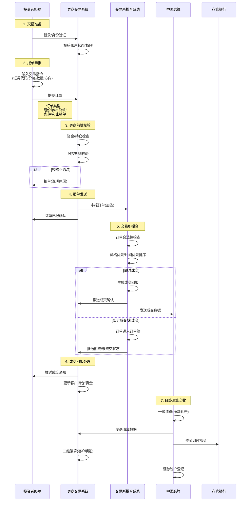
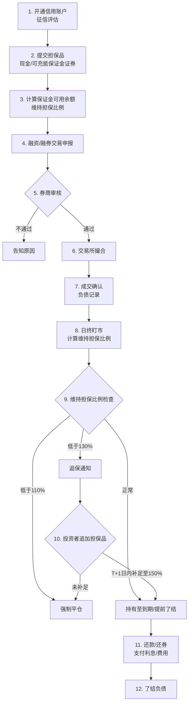
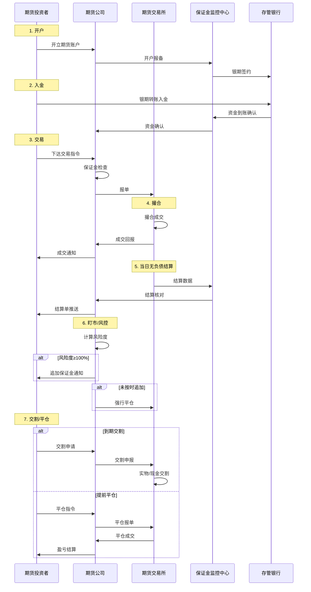
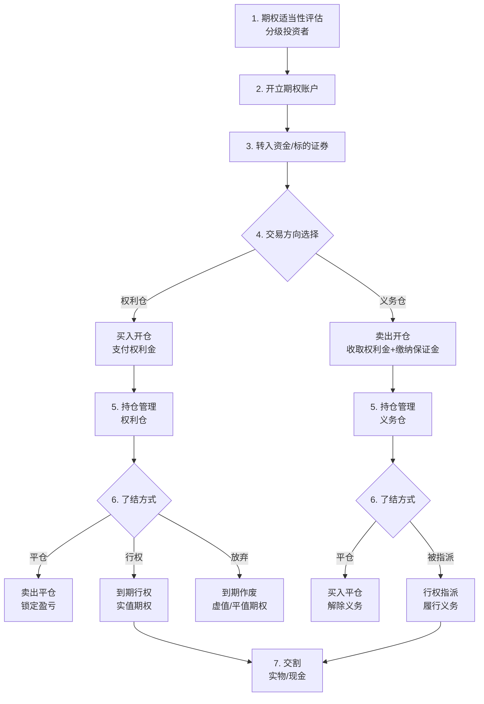
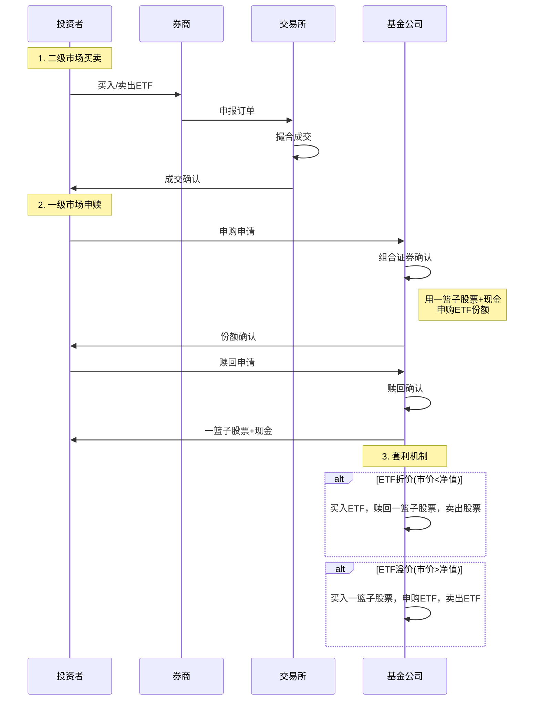
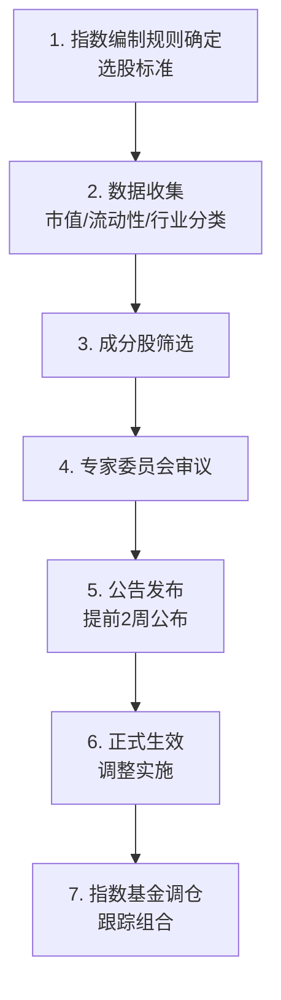
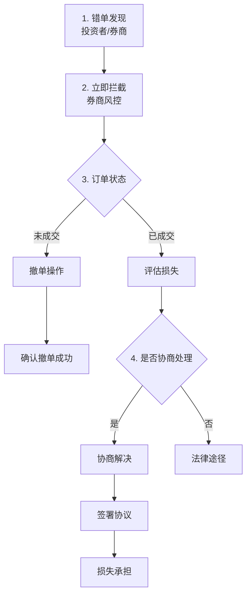

# 证券交易 - 核心业务流程详解

> **文档类型**: 业务流程规范
> **最后更新**: 2026-05-08
> **适用范围**: 证券交易系统 - 业务流程参考

---

## 一、股票交易全流程（最高频场景）

### 1.1 流程概述
**业务背景**: 投资者通过券商交易系统进行股票买卖，涉及报单、撮合、清算、交收全链路。

**涉及角色**:
- 个人/机构投资者（交易发起方）
- 券商经纪商（通道服务商）
- 交易所（撮合方）
- 登记结算公司（清算交收方）
- 存管银行（资金存管方）

### 1.2 详细流程



### 1.3 关键节点说明

#### 节点1: 交易准备
**操作人**: 投资者

**身份验证**:
- 账号密码登录
- 短信验证码/生物识别
- 交易密码确认

**账户检查项**:
- 账户状态正常（未冻结/注销）
- 风险测评有效期内
- 适当性匹配（创业板/科创板/北交所权限）

#### 节点2: 报单申报
**操作人**: 投资者

**交易指令要素**:
| 字段 | 说明 | 必填 |
|-----|------|------|
| 证券代码 | 6位代码（沪/深/北交所） | 是 |
| 买卖方向 | 买入/卖出 | 是 |
| 委托价格 | 限价/市价 | 是 |
| 委托数量 | 股数（100股整数倍） | 是 |
| 订单类型 | 限价单/市价单/条件单 | 是 |
| 有效期 | 当日有效/长期有效 | 否 |

**订单类型**:
```
限价单：指定价格，≥限价买入或≤限价卖出
市价单：即时最优价格成交，包括：
  - 对手方最优价格
  - 本方最优价格
  - 即时成交剩余撤销
  - 即时成交剩余转限价
  - 五档即成剩撤
  - 五档即成剩转
条件单：价格/时间/涨跌幅触发后自动下单
止损单：价格跌破/涨破阈值触发止损
```

#### 节点3: 券商前端校验
**系统操作**: 券商交易系统

**资金/持仓检查**:
- 买入：可用资金 ≥ 委托金额 + 手续费
- 卖出：可用持仓 ≥ 委托数量（T+1规则）
- 不允许卖空（融券业务除外）

**风控规则校验**:
- 单笔委托上限（不超过100万股）
- 单日累计委托次数
- 异常交易监控（频繁报撤单）
- 涨跌停板价格限制

#### 节点4: 报单发送
**系统操作**: 券商交易系统

**报单要求**:
- 订单加签（CA证书）
- 时间戳记录
- 流量控制（每秒报单量限制）

#### 节点5: 交易所撮合
**系统操作**: 交易所撮合系统

**撮合原则**:
- **价格优先**: 较高价格买入申报优先于较低价格买入申报，较低价格卖出申报优先于较高价格卖出申报
- **时间优先**: 同价位申报，先申报者优先

**集合竞价时间**:
- 沪市/深市主板：9:15-9:25（开盘），14:57-15:00（收盘）
- 科创板/创业板：9:15-9:25（开盘），14:57-15:00（收盘），15:00-15:30（盘后定价）
- 北交所：9:15-9:25（开盘），14:57-15:00（收盘）

**连续竞价时间**:
- 9:30-11:30，13:00-14:57

**成交回报字段**:
- 成交编号
- 成交价格
- 成交数量
- 成交时间
- 剩余未成交数量

#### 节点6: 成交回报处理
**系统操作**: 券商交易系统

**更新内容**:
- 客户资金账户：冻结资金→实扣资金
- 客户证券账户：冻结持仓→过户持仓
- 交易记录：记录成交明细

#### 节点7: 日终清算交收
**系统操作**: 中国结算

**清算交收周期**:
- A股：T+1日交收
- 资金：T+1日可取，T+0可用

**清算流程**:
```
一级清算：中国结算 ↔ 券商（净额）
二级清算：券商 ↔ 投资者（明细）
```

**交收内容**:
- 证券过户：卖方账户→买方账户
- 资金划付：买方账户→卖方账户
- 税费扣缴：印花税/过户费/佣金

---

## 二、融资融券交易流程

### 2.1 流程概述
**业务背景**: 投资者向券商借入资金买入（融资）或借入证券卖出（融券），需提供担保品。

**涉及角色**:
- 融资融券投资者
- 券商信用交易部门
- 证券金融公司（转融通）
- 登记结算公司

### 2.2 详细流程



### 2.3 关键节点说明

#### 信用账户开通
**准入条件**:
- 证券交易经验满6个月
- 近20个交易日日均资产≥50万元
- 风险测评C4及以上
- 无不良诚信记录

**可充抵保证金证券**:
- 上证180成分股：折算率最高70%
- 其他A股：折算率最高65%
- 科创板股票：折算率最高60%
- 现金：折算率100%

#### 保证金计算公式
```
保证金可用余额 = ∑(担保品市值 × 折算率) - ∑(未了结融资本金/融券卖出金额) - ∑(利息/费用) - 风险准备金

维持担保比例 = (现金 + 信用证券账户内证券市值总和) / (融资买入金额 + 融券卖出证券数量 × 当前市价 + 利息及费用总和)
```

**维持担保比例警戒线**:
- ≥300%：可提取担保品
- 150%-300%：正常区间
- 130%-150%：警戒线，关注
- 110%-130%：追保线，需T+1日内补足至150%
- <110%：平仓线，强制平仓

#### 强制平仓
**触发情形**:
- 维持担保比例低于110%且未按时补足
- 融资/融券到期未了结
- 合同约定的其他情形

**平仓范围**:
- 优先平仓高风险证券
- 按比例平仓或全部平仓
- 平仓至维持担保比例≥150%

---

## 三、期货交易流程

### 3.1 流程概述
**业务背景**: 期货交易采用保证金制度、当日无负债结算，支持双向交易。

**涉及角色**:
- 期货投资者
- 期货公司
- 期货交易所
- 期货保证金监控中心
- 期货存管银行

### 3.2 详细流程



### 3.3 期货合约类型

| 合约类型 | 代表品种 | 交易单位 | 最小变动价位 | 涨跌停板 |
|---------|---------|---------|-------------|---------|
| 商品期货 | 铜、大豆、原油 | 吨/桶/手 | 1元/0.1元 | ±5%~±8% |
| 金融期货 | 沪深300、中证500 | 指数点 × 乘数 | 0.2点 | ±10% |
| 国债期货 | 2年期、5年期、10年期 | 面值 × 乘数 | 0.005元 | ±1.2%~±2% |
| 股指期货 | IF、IC、IH | 300元/点 | 0.2点 | ±10% |
| 期权 | 股指期权、商品期权 | 张 | 0.01点 | - |

#### 保证金制度
```
交易保证金 = 合约价值 × 保证金比例
合约价值 = 成交价格 × 交易单位

例：IF2306合约价格4000点
合约价值 = 4000 × 300 = 1,200,000元
交易保证金 = 1,200,000 × 12% = 144,000元
```

#### 当日无负债结算
**结算价**:
- 商品期货：当日成交均价
- 股指期货：最后1小时成交均价

**结算流程**:
1. 计算当日盈亏
2. 划转盈亏资金
3. 计算交易保证金
4. 释放/追加保证金

**盈亏计算**:
```
当日盈亏 = 平当日仓盈亏 + 历史持仓盈亏
平当日仓盈亏 = ∑[(卖出价-买入价) × 数量]
历史持仓盈亏 = ∑[(结算价-上日结算价) × 持仓量]
```

---

## 四、期权交易流程

### 4.1 流程概述
**业务背景**: 期权交易是权利交易，买方支付权利金获得权利，卖方收取权利金承担义务。

**涉及角色**:
- 期权投资者（买方/卖方）
- 期权经营机构
- 期权交易所
- 登记结算公司

### 4.2 详细流程



### 4.3 期权合约要素

| 要素 | 说明 | 示例 |
|-----|------|------|
| 合约标的 | 期权标的资产 | 50ETF、沪深300指数 |
| 合约类型 | 认购/认沽 | 认购期权（看涨） |
| 到期月份 | 合约到期月份 | 当月、下月、季月 |
| 行权价格 | 约定买卖价格 | 3.000、3.100... |
| 行权方式 | 欧式/美式 | 欧式（到期日行权） |
| 合约单位 | 每份期权对应标的数量 | 10000份50ETF |
| 报价单位 | 权利金报价单位 | 元/股 |
| 最小变动价位 | 价格变动最小单位 | 0.0001元 |

#### 期权买方（权利方）
**权利**:
- 选择是否行权
- 选择何时平仓
- 最大损失：权利金

**了结方式**:
```
1. 卖出平仓：提前了结，锁定盈亏
2. 行权：到期时实值期权行权
3. 放弃：虚值/平值期权到期作废
```

#### 期权卖方（义务方）
**义务**:
- 缴纳保证金（逐日盯市）
- 被指派时履行义务

**保证金计算公式**:
```
认购期权义务仓保证金 = 
  Max[权利金 + 合约标的前收盘价 × 12% - 虚值额, 
      权利金 + 合约标的前收盘价 × 7%]

认沽期权义务仓保证金 = 
  Max[权利金 + 合约标的前收盘价 × 12% - 虚值额, 
      权利金 + 行权价格 × 7%]
```

#### 期权价值组成
```
期权价值 = 内在价值 + 时间价值

内在价值 = Max(行权价值, 0)
  - 认购期权内在价值 = Max(标的价格 - 行权价格, 0)
  - 认沽期权内在价值 = Max(行权价格 - 标的价格, 0)

时间价值 = 期权价格 - 内在价值
```

---

## 五、指数及指数成分股交易流程

### 5.1 指数交易类型

| 交易类型 | 产品形态 | 交易方式 | 代表产品 |
|---------|---------|---------|---------|
| 指数期货 | 期货合约 | 保证金交易 | IF（沪深300）、IC（中证500） |
| 指数期权 | 期权合约 | 权利金交易 | 沪深300股指期权 |
| ETF | 交易型开放式基金 | 现金申赎/买卖 | 50ETF、300ETF |
| 指数基金 | 场外基金 | 金额申购/份额赎回 | 沪深300指数基金 |
| 指数增强 | 主动管理基金 | 金额申购/份额赎回 | 各类指数增强产品 |

### 5.2 ETF交易流程



### 5.3 指数成分股调整

**调整频率**:
- 沪深300/中证500：每半年调整一次（6月、12月）
- 上证50：每半年调整一次
- 科创50：每季度调整一次

**调整流程**:


**调整影响**:
- 调入股票：被动资金买入，短期上涨
- 调出股票：被动资金卖出，短期下跌
- 跟踪基金：组合调整，产生交易成本

---

## 六、交易异常处理流程

### 6.1 异常情形分类

| 异常类型 | 典型场景 | 处理原则 |
|---------|---------|---------|
| 交易系统故障 | 系统宕机、通讯中断 | 暂停交易、切换灾备 |
| 订单异常 | 错单、乌龙指 | 拦截、撤销、调整 |
| 市场异常 | 剧烈波动、连续涨跌停 | 临时停牌、熔断机制 |
| 结算异常 | 资金不足、清算失败 | 垫付、延迟交收 |

### 6.2 错单处理流程



### 6.3 熔断机制

**沪深300指数熔断阈值**:
```
一级熔断：涨/跌幅达5%
  - 熔断15分钟
  - 熔断结束后恢复交易
  
二级熔断：涨/跌幅达7%
  - 熔断至收市
  - 不再恢复交易
```

**科创板/创业板临时停牌**:
- 盘中交易价格较开盘价首次上涨/下跌达到30%
- 盘中交易价格较开盘价首次上涨/下跌达到60%
- 单次盘中临时停牌时间为10分钟

---

## 七、流程设计原则

### 7.1 交易安全原则
- **事前风控**：订单校验、风险检查
- **事中监控**：实时监控、异常预警
- **事后审计**：交易留痕、可追溯

### 7.2 公平交易原则
- **价格优先**：同价位申报时间优先
- **公平接入**：所有投资者平等接入
- **信息对称**：交易信息公平披露

### 7.3 结算安全原则
- **分级结算**：交易所↔券商↔投资者
- **货银对付**：一手交钱一手交货
- **共同对手方**：CCP中央对手方担保

### 7.4 异常处理原则
- **快速响应**：第一时间发现和处理
- **最小影响**：控制影响范围
- **及时披露**：信息公开透明

---

## 八、流程优化方向

### 8.1 技术优化
- **低延迟交易**：极速订单路由，微秒级报单
- **智能路由**：最优价格路径选择
- **算法交易**：TWAP/VWAP等智能下单

### 8.2 风控优化
- **AI风控**：机器学习识别异常交易
- **实时预警**：风险指标实时监控
- **动态保证金**：根据市场波动调整保证金

### 8.3 体验优化
- **智能下单**：语音下单、条件单自动触发
- **可视化**：交易看板、盈亏分析
- **移动化**：APP端全功能交易
