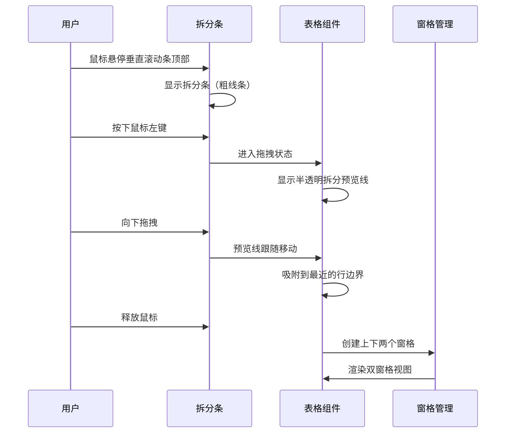

# 附件A：页面与交互说明

> **文档状态**: 草稿  
> **版本**: v1.0.0  
> **关联PRD**: [PRD_Main.md](./PRD_Main.md)

---

## 1. 页面结构

### 1.1 普通视图（未拆分）

```
┌─────────────────────────────────────────────────────────┐
│  工具栏  [文件][编辑][视图][插入][格式]...              │
│  [视图]菜单 ──┐                                         │
│               │ [拆分] [冻结窗格]...                    │
├───────────────┴─────────────────────────────────────────┤
│  ┌───────────────────────────────────────────────────┐ │
│  │ A │ B │ C │ D │ E │ ... │                       │ │
│  ├───┼───┼───┼───┼───┼─────┤                       │ │
│  │ 1 │   │   │   │   │     │                       │ │
│  │ 2 │   │   │   │   │     │                       │ │
│  │ 3 │   │   │   │   │     │                       │ │
│  │...│   │   │   │   │     │                       │ │
│  └───────────────────────────────────────────────────┘ │
│                    [水平滚动条]                         │
└─────────────────────────────────────────────────────────┘
         ↑                           ↑
    垂直滚动条                  水平滚动条
```

**拆分条位置**：
- 垂直滚动条顶部：水平拆分条（默认隐藏，悬停显示）
- 水平滚动条右侧：垂直拆分条（默认隐藏，悬停显示）

---

## 2. 交互详情

### 2.1 水平拆分交互（F01）

**触发方式**：
1. 方式一：拖拽垂直滚动条顶部的拆分条
2. 方式二：视图菜单 → 拆分（在当前活动行位置拆分）
3. 方式三：快捷键 Alt+W,S

**拖拽交互流程**：



**拆分后效果**：

```
┌─────────────────────────────────────────────────────────┐
│  工具栏...                                              │
├─────────────────────────────────────────────────────────┤
│  ┌───────────────────────────────────────────────────┐ │
│  │ A │ B │ C │ D │ E │ ... │                       │ │
│  ├───┼───┼───┼───┼───┼─────┤  上窗格              │ │
│  │ 1 │   │   │   │   │     │  (显示行1-10)         │ │
│  │...│   │   │   │   │     │                       │ │
│  │10 │   │   │   │   │     │                       │ │
│  └───────────────────────────────────────────────────┘ │
│  ═══════════════ 水平拆分条 ═══════════════════════════│
│  ┌───────────────────────────────────────────────────┐ │
│  │ A │ B │ C │ D │ E │ ... │                       │ │
│  ├───┼───┼───┼───┼───┼─────┤  下窗格              │ │
│  │11 │   │   │   │   │     │  (显示行11-20)        │ │
│  │...│   │   │   │   │     │                       │ │
│  └───────────────────────────────────────────────────┘ │
│                    [水平滚动条]                         │
└─────────────────────────────────────────────────────────┘
```

**上/下窗格关系**：
- 共享水平滚动条
- 各自有独立的垂直滚动条（或在滚动条上显示两个滑块）
- 水平滚动时，两窗格同步左右滚动
- 垂直滚动时，两窗格独立滚动

---

### 2.2 垂直拆分交互（F02）

**触发方式**：
1. 方式一：拖拽水平滚动条右侧的拆分条
2. 方式二：视图菜单 → 拆分（在当前活动列位置拆分）
3. 方式三：快捷键 Alt+W,S

**拆分后效果**：

```
┌─────────────────────────────────────────────────────────┐
│  工具栏...                                              │
├─────────────────────────────────────────────────────────┤
│  ┌──────────────────┐ │ ┌──────────────────────────┐ │
│  │ A │ B │ C │ ... │ │ │ G │ H │ I │ ...        │ │
│  ├───┼───┼───┼─────┤ │ ├───┼───┼───┼─────        │ │
│  │ 1 │   │   │     │ │ │ 1 │   │   │             │ │
│  │ 2 │   │   │     │ │ │ 2 │   │   │             │ │
│  │ 3 │   │   │     │ │ │ 3 │   │   │             │ │
│  │...│   │   │     │ │ │...│   │   │             │ │
│  └──────────────────┘ │ └──────────────────────────┘ │
│         左窗格         ║        右窗格              │
│    (显示列A-F)      垂直拆分条     (显示列G-L)        │
└─────────────────────────────────────────────────────────┘
           [垂直滚动条]                    [垂直滚动条]
```

**左/右窗格关系**：
- 共享垂直滚动条
- 各自有独立的水平滚动条
- 垂直滚动时，两窗格同步上下滚动
- 水平滚动时，两窗格独立滚动

---

### 2.3 四宫格拆分交互（F03）

**触发方式**：
1. 先水平拆分，再垂直拆分
2. 或先垂直拆分，再水平拆分
3. 拖拽两个拆分条到交叉位置

**四宫格效果**：

```
┌─────────────────────────────────────────────────────────┐
│  工具栏...                                              │
├─────────────────────────────────────────────────────────┤
│  ┌──────────────┐ │ ┌──────────────────────────────┐ │
│  │ A │ B │ ... │ │ │ E │ F │ G │ ...            │ │
│  ├───┼───┼─────┤ │ ├───┼───┼───┼─────            │ │
│  │ 1 │   │     │ │ │ 1 │   │   │                 │ │
│  │ 2 │   │     │ │ │ 2 │   │   │                 │ │
│  └──────────────┘ │ └──────────────────────────────┘ │
│      左上窗格     ║          右上窗格                 │
│  ════════════════╬═ 水平拆分条 ════════════════════│
│  ┌──────────────┐ │ ┌──────────────────────────────┐ │
│  │ A │ B │ ... │ │ │ E │ F │ G │ ...            │ │
│  ├───┼───┼─────┤ │ ├───┼───┼───┼─────            │ │
│  │ 5 │   │     │ │ │ 5 │   │   │                 │ │
│  │ 6 │   │     │ │ │ 6 │   │   │                 │ │
│  └──────────────┘ │ └──────────────────────────────┘ │
│      左下窗格     ║          右下窗格                 │
└─────────────────────────────────────────────────────────┘
     ↑                     ↑
  垂直滚动条            垂直滚动条
```

**四宫格滚动规则**：

| 操作窗格 | 同步滚动的窗格 | 独立滚动的窗格 |
|---------|--------------|--------------|
| 左上 | 左下（垂直）、右上（水平） | 右下 |
| 右上 | 右下（垂直）、左上（水平） | 左下 |
| 左下 | 左上（垂直）、右下（水平） | 右上 |
| 右下 | 右上（垂直）、左下（水平） | 左上 |

---

### 2.4 拆分条拖拽交互（F04）

**视觉状态**：

| 状态 | 鼠标样式 | 拆分条样式 |
|-----|---------|-----------|
| 默认隐藏 | - | 不显示 |
| 悬停 | ↕（水平拆分）或 ↔（垂直拆分） | 3px灰色条 |
| 拖拽中 | 拖拽样式 | 5px半透明蓝色条 + 预览线 |

**拖拽吸附**：
- 拖拽位置自动吸附到最近的行/列边界
- 吸附范围：±5px
- 吸附时提供轻微的触觉反馈（如有的话）

---

### 2.5 取消拆分交互（F05）

**触发方式**：
1. 方式一：双击拆分条
2. 方式二：拖拽拆分条到窗口边缘之外
3. 方式三：视图菜单 → 取消拆分
4. 方式四：快捷键 Alt+W,S（再次按）

**取消后的状态**：
- 恢复单窗口视图
- 滚动位置定位到活动窗格的当前位置
- 选中单元格保持不变

---

### 2.6 数据同步更新（F07）

**同步示例**：

```
四宫格视图：
┌──────────────────┬──────────────────┐
│ 左上窗格         │  右上窗格        │
│  A1: "旧值"      │  A1: "旧值"     │
├──────────────────┼──────────────────┤
│  左下窗格         │  右下窗格        │
│  A1: "旧值"      │  A1: "旧值"     │
└──────────────────┴──────────────────┘

用户在左上窗格修改A1为"新值"后：
┌──────────────────┬──────────────────┐
│ 左上窗格         │  右上窗格        │
│  A1: "新值" ←───┼─→ A1: "新值"    │
├──────────────────┼──────────────────┤
│  左下窗格         │  右下窗格        │
│  A1: "新值" ←───┼─→ A1: "新值"    │
└──────────────────┴──────────────────┘
     ↑                     ↑
  同步更新              同步更新
```

---

### 2.7 活动窗格标识（F08）

**标识方式**：
- 活动窗格边框：2px高亮蓝色边框
- 非活动窗格：无特殊边框
- 选中单元格：仅在活动窗格中显示高亮

**示例**：

```
┌─────────────────────────────────┐
│ ┌─────────────┐  ┌───────────┐  │
│ │ 左上窗格   │  │ 右上窗格  │  │
│ │ (活动)     │  │           │  │
│ │ [选中]     │  │           │  │
│ └─────────────┘  └───────────┘  │
│  ↑ 2px蓝色边框                  │
│ ┌─────────────┐  ┌───────────┐  │
│ │ 左下窗格   │  │ 右下窗格  │  │
│ │             │  │           │  │
│ └─────────────┘  └───────────┘  │
└─────────────────────────────────┘
```

---

## 3. 菜单与快捷键

### 3.1 视图菜单

```
[视图]
├─── 拆分窗口
│    ├─── 水平拆分
│    ├─── 垂直拆分
│    └─── 取消拆分
├─── 冻结窗格
│    ├─── 冻结首行
│    ├─── 冻结首列
│    └─── 取消冻结
└─── ...
```

### 3.2 快捷键

| 操作 | Windows快捷键 | Mac快捷键 |
|-----|--------------|---------|
| 拆分/取消拆分 | Alt+W,S | ⌥+W,S |
| 在窗格间切换 | F6 | F6 |
| 移动到下一窗格 | Ctrl+F6 | ⌃+F6 |

---

## 4. 使用场景示例

### 4.1 场景一：财务报表对账

```
用户需要核对表尾的合计数是否等于表中各分项之和：

┌─────────────────────────────────────┐
│  ┌───────────────────────────────┐ │
│  │ 科目      │  金额    │ ...  │ │ ← 上窗格：显示表头
│  ├───────────┼──────────┼──────┤ │   和数据区域
│  │ 销售A     │ 10,000  │      │ │
│  │ 销售B     │ 20,000  │      │ │
│  └───────────────────────────────┘ │
│  ═══════════════════════════════════│
│  ┌───────────────────────────────┐ │
│  │ ...                        │ │
│  ├───────────────────────────────┤ │
│  │ 合计      │ 30,000  │      │ │ ← 下窗格：
│  └───────────────────────────────┘ │   固定显示合计行
└─────────────────────────────────────┘
```

### 4.2 场景二：宽表数据录入

```
用户需要参照左侧的产品编码，在右侧录入数据：

┌───────────────────────────────────────────────────────┐
│  ┌──────────────┐ │ ┌──────────────────────────────┐ │
│  │ 产品编码 │   │ │ 规格 │ 价格 │ 库存 │ ...   │ │
│  ├──────────────┤ │ ├──────┼──────┼──────┼─────┤ │
│  │ P001     │<──┼─>│ 大  │ 100  │ 50   │      │ │
│  │ P002     │<──┼─>│ 中  │ 200  │ 30   │      │ │
│  │ P003     │<──┼─>│ 小  │ 150  │ 80   │      │ │
│  └──────────────┘ │ └──────────────────────────────┘ │
│     左窗格                    右窗格                  │
│  (固定显示产品编码)        (数据录入区域)             │
└───────────────────────────────────────────────────────┘
```

---

## 5. 与冻结窗格的区别

| 特性 | 拆分窗口 | 冻结窗格 |
|-----|---------|---------|
| 目的 | 同时查看不同区域 | 固定表头/表首不滚动 |
| 窗格数量 | 2或4个 | 保持1个 |
| 滚动 | 各窗格独立滚动 | 只有一个滚动区域 |
| 调整位置 | 拖拽拆分条 | 设置冻结行列 |
| 视觉效果 | 明显的拆分条 | 冻结线较细 |
| 可同时使用 | 是 | 是 |

**同时使用示例**：

```
┌─────────────────────────────────────────┐
│  ┌───────────────────────────────────┐ │
│  │ [冻结: 首行]   A │ B │ C │ ... │ │
│  ├───────────────────────────────────┤ │
│  │ 1 │   │   │   │     │ 上窗格    │ │
│  │ 2 │   │   │   │     │ (冻结首行)│ │
│  ════════════════════════════════════│
│  │10 │   │   │   │     │ 下窗格    │ │
│  │11 │   │   │   │     │ (冻结首行)│ │
│  └───────────────────────────────────┘ │
└─────────────────────────────────────────┘
```
