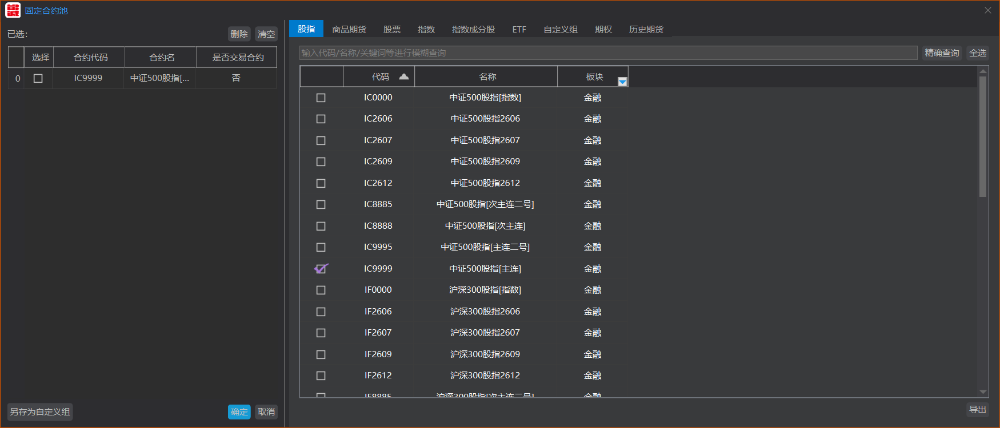

你是一位拥有10年经验的资深金融系统前端架构师。请根据我提供的系统截图，用 HTML、CSS 和原生 JS 高保真还原这个“固定合约池”弹窗。

**核心开发要求：**

1. **单文件输出**：所有的 HTML、CSS 和交互代码必须写在一个 `.html` 文件中，方便我直接双击预览。
2. **高保真还原**：严格遵循截图中的暗黑主题、布局比例、字体排版和按钮样式。
3. **自适应与滚动**：弹窗应在屏幕居中，左右两侧数据较多时必须支持独立的内部垂直滚动条（自定义滚动条样式为暗色系）。

**色彩与样式规范（Dark Mode）：**

- **主背景色**：深灰色（参考 `#2A2A2A`）
- **面板背景色**：更深的灰色（参考 `#1E1E1E`）
- **文本颜色**：主文本亮灰色（`#E0E0E0`），次要文本稍暗。
- **品牌强调色**：亮蓝色（参考 `#2196F3`），用于激活的Tab项文字及下划线、主按钮（Primary Button，如“确定”按钮的背景）。
- **边框与分割线**：暗灰色（参考 `#444444`）。

**页面结构与细节描述：**

1. **弹窗头部 (Modal Header)**
   - 左侧：系统小图标（可以用红色小方块 CSS 模拟） + 标题文字“固定合约池”。
   - 右侧：关闭图标（X）。
   - 头部下方有一条细分割线（注意最左侧图标下有一小段蓝色高亮）。

2. **主体布局 (Modal Body - 左右分栏)**
   - 整体左右分栏，左侧宽度约占 35%，右侧约占 65%，中间有垂直分割线。

3. **左侧面板 (已选区域)**
   - **顶部**：文字“已选:”，靠右有两个次级按钮（深色背景、浅色边框）：“删除”和“清空”。
   - **表格区**：
     - 表头包含 4 列：`选择`(Checkbox)、`合约代码`、`合约名`、`是否交易合约`。
     - 表格数据：请写死一条示例数据 -> `未勾选`, `IC2606`, `中证500股指...`, `否`。
   - **底部操作区**：
     - 左对齐：按钮“另存为自定义组”。
     - 右对齐：主按钮“确定”（蓝色背景）和 次级按钮“取消”。

4. **右侧面板 (候选区域)**
   - **顶部 Tabs**：水平排列的菜单，依次包括：`股指`, `商品期货`, `股票`, `港股通`, `指数`, `商品指数`, `指数成分股`, `ETF`, `自定义组`, `期权`, `历史期货`。
     - **当前激活态**：请默认激活“指数成分股”（文字为蓝色，底部有蓝色下划线）。
   - **搜索区**：一个占据大部分宽度的深色输入框，placeholder 为“输入代码/名称/关键词等进行模糊查询”。右侧紧跟两个按钮：“精确查询”和“全选”。
   - **内容展示区（需根据当前激活的 Tab 动态显示不同结构）**：
     - **场景 A（当处于“商品指数”、“股指”等通用版块时）**：
       - **结构**：带有表头的标准表格。
       - **表头**：包含 4 列：`选择`(Checkbox)、`代码`、`名称`、`板块`（带下拉箭头图标）。
       - **模拟数据**：NHA0000(南华农产品[指数] | 南华), NHC0000(南华商品[指数] | 南华) 等。
     - **场景 B（当处于“港股通”版块时）**：
       - **结构**：带有表头的标准表格。
       - **表头**：仅包含 3 列：`选择`(Checkbox)、`代码`、`名称`。（无“板块”列）。
       - **模拟数据**：00001HK(长和), 00002HK(中电控股) 等。
     - **场景 C（当处于“指数成分股”版块时）**：
       - **结构变化**：不再是标准表格，且**没有表头**，而是一个**多层级的树形控件（Tree View）**。
       - **节点元素**：每一行从左到右依次包含：层级缩进、折叠/展开箭头（`▶`或`▼`）、自定义复选框（Checkbox）、图标（特定节点带有一个类似 `⊕` 的加号图标）、文字说明。
       - **模拟数据（请实现以下层级结构）**：
         - `▶ [ ] 000905SH ⊕ 中证500历史成分股`
         - `▶ [ ] 000905SH ⊕ 中证500最新成分股`
         - `▼ [ ] 同花顺指数最新成分股`
           - `▶ [ ] 概念指数`
           - `▶ [ ] 行业指数`
           - `▶ [ ] 地域指数`
           - `▼ [ ] 特色指数`
             - `▶ [ ] 883400TI ⊕ 昨日ST首板股表现`
             - `▶ [ ] 883403TI ⊕ 佛山`
         - `▼ [ ] 选股通指数最新成分股`
           - `▶ [ ] 行业指数`
           - `▶ [ ] 概念指数`
           - `▶ [ ] 风格指数`
         - `▼ [ ] 能化指数最新成分股`
           - `▶ [ ] 换手率指数`
           - `▶ [ ] 跌停指数`
   - **底部操作区**：右下角孤立放置一个次级按钮“导出”。

**交互要求：**

1. 所有按钮、Tab项和数据行需增加 hover 悬浮高亮效果。
2. 表单 Checkbox 需自定义样式，使其符合深色主题（不要用浏览器默认的白底复选框）。
3. 使用 JS 实现简单的双向联动：勾选右侧的数据，左侧表格能动态增加该行；取消勾选，左侧移除该行。
4. **【核心】Tab 切换交互**：点击不同的 Tab，右侧主体区域需要在“带表头的标准表格”（如港股通）和“无表头的树形控件”（如指数成分股）之间无缝切换结构与数据。
5. **树形控件交互**：点击“指数成分股”树节点的展开/折叠箭头，能够平滑地显示或隐藏其子节点。
