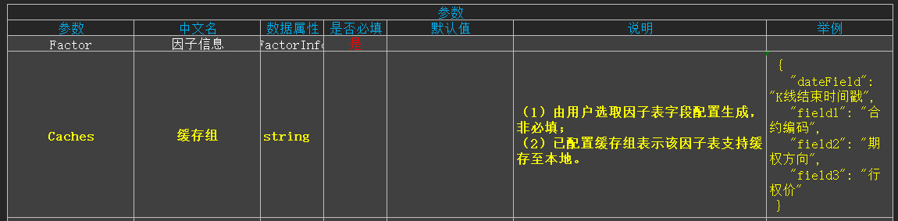
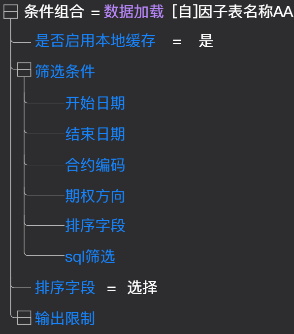
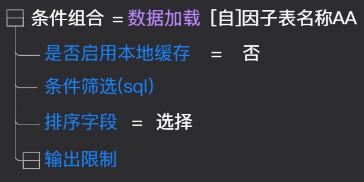
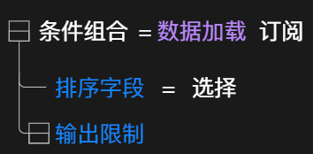
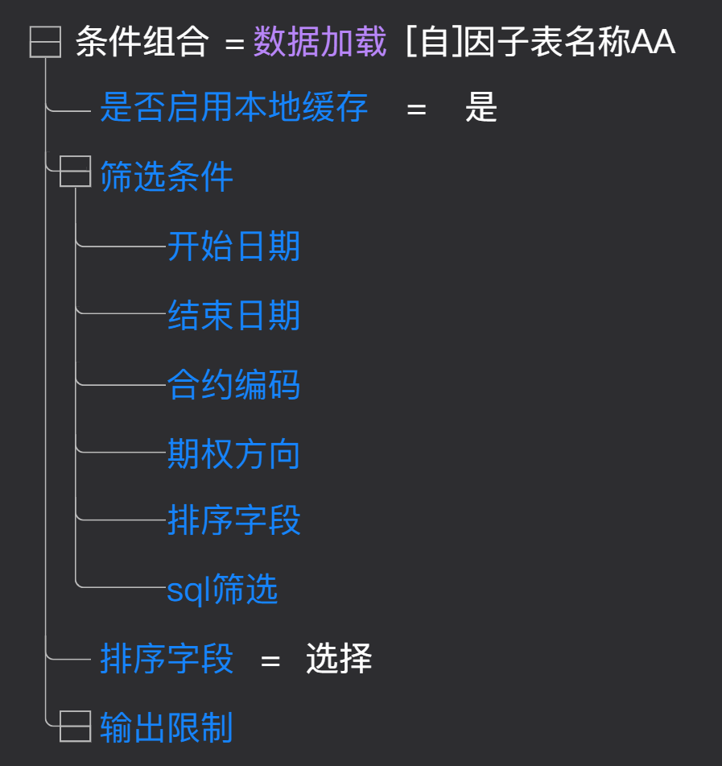
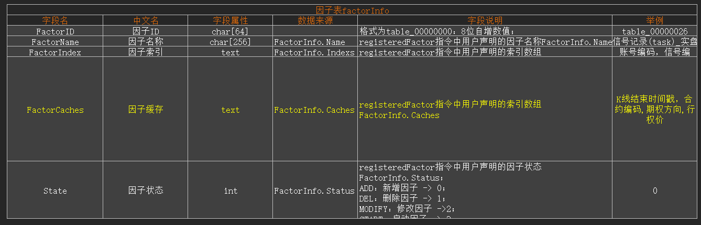

# 因子服务支持本地缓存功能PRD

> **文档状态**: 草稿  
> **版本**: v1.0.0  
> **作者**: 易伟  
> **创建日期**: 2026-05-12  

## 1背景与现状（Why）

**现状描述**：
当远端因子文件较大时，加载速度较慢

**痛点**：

1. 数据加载速度慢
2. 加载时间长
3. 用户等待时间长

**优化**：
通过本地缓存，将因子数据存储在本地，提高数据加载速度，减少用户等待时间

## 2功能清单

| 编号 | 功能名称 | 功能描述 | 优先级 |
| ---- | -------- | -------- | ------ |
| F01 | 配置因子表缓存 | 给支持缓存的因子表文件提供配置识别唯一性字段的功能 | P0 |
| F02 | 数据加载算法升级 | 升级因子数据加载算法，支持因子表写入本地缓存，同时支持从T_factor表中读取因子数据，可二次筛选后加载至内存 | P0 |
| F03 | 新增T_factor表 | 在本地cache中新增表【T_factor】，用于存储因子数据 | P0 |

## 3 配置因子表缓存唯一标识字段

### 3.1 功能路径

因子文件树-》因子表文件。

### 3.2 功能点

（1）因子表文件顶部新增配置按钮。

（2）鼠标移入按钮显示tooltips“配置因子缓存”。

（3）点击配置按钮，弹出配置对话框。

（4）状态为已注册及未注册的因子都支持该功能。

### 3.3 配置对话框

（1）对话框字段说明：

    a.日期：必填，下拉单选，选项读取当前因子表中所有字段。

    b.字段1：非必填，下拉单选，选项读取当前因子表中所有字段。

    c.字段2：非必填，下拉单选，选项读取当前因子表中所有字段。

    d.字段3：非必填，下拉单选，选项读取当前因子表中所有字段。

（2）字段限制：

    a.字段唯一性：字段间已选项不能重复，如果已选择，则不能在其它字段中选择。例如：在字段1中已选择"合约"，则不能在字段2、字段3、字段4中选择"合约"。否则给出错误提示“当前字段已被选中，无法选择”。

    b.修改限制：配置成功后，对话框所有字段不支持修改；光标移入下拉单选组件时，变更为禁用图标。

（3）【确定】按钮:

    a.点击确定按钮，需要做必填项校验及索引校验。

    b.必填项校验：字段“日期”不能为空，如果为空，则提示错误信息“日期为必填项！”。

    c.已注册的因子表校验通过后，则向因子服务发起配置请求；未注册的因子表校验通过后，则在注册时一起发送配置请求到因子服务。

（4）【取消】按钮：

点击取消按钮，关闭对话框。

（5）对话框原型：

### 3.4 修改因子缓存

（1）限制条件：

仅未被使用的因子支持修改缓存。

（2）报错信息提示方式：

"因子表[XXXX]修改因子缓存失败,检测到当前正在被[N]个用户订阅使用中，使用这IP地址为：x.x.x.x|x.x.x.x|x.x.x.x|...."；

### 3.5 后端需求

（1）量化侧：

  a.调用因子服务接口，填写对应参数，完成配置因子缓存。

  b.参数:
  

（2）因子服务侧：

  a.注册因子接口升级：链接(待补充)

  b.新增因子缓存配置接口：链接(待补充)

## 4 升级算法《数据加载》

### 4.1 算法用途

当前数据加载算法仅支持将数据加载至内存中，升级后，根据配置的【Caches】参数，将数据写入数据库的【T_factor】表中，同时根据筛选条件，从【T_factor】表中读取数据，并加载至内存中。

### 4.2 新增节点【是否启用因子服务本地缓存】【条件筛选（cache）】

(1) 当订阅对象为map表对应的task文件【存储】设置的因子表，且该因子表已经配置【Caches】，则显示节点，否则节点不展示。

(2) 【是否启用本地缓存】节点：类型： boolean，默认值为是。

a.选【是】，则展示【筛选条件】节点。

b.选【否】，则不展示【筛选条件】节点，展示【条件筛选(sql)】节点。

(3) 【筛选条件】节点：

a.子节点1：开始日期，默认为空，必填，支持搭建任意算法。

b.子节点2：结束日期，默认为空，必填，支持搭建任意算法。

c.子节点3：根据Caches配置的field1动态展示(未配置则不展示节点)，默认为空，必填，支持搭建任意算法；举例：field1为合约编码，则动态展示【合约编码】节点。

d.子节点4：根据Caches配置的field2动态展示(未配置则不展示节点)，默认为空，必填，支持搭建任意算法；举例：field2为期权方向，则动态展示【期权方向】节点。

e.子节点5：根据Caches配置的field3动态展示(未配置则不展示节点)，默认为空，必填，支持搭建任意算法；举例：field3为行权价，则动态展示【行权价】节点。

d.子节点6：sql条件，默认为空，非必填，支持搭建任意算法。

### 4.3 更改节点【自定义筛选】名称

（1）原【自定义筛选】名称更改为【自定义筛选(csv)】。

（2）原先版本无须升级。

### 4.4 优化筛选类节点显示逻辑

（1）节点根据对订阅对象task存储对象不同进行展示。

| 节点 | 存储对象 |
| ---- | -------- |
| 条件筛选(sql) | DB/Mysql/因子数据服务 |
| 条件筛选(hbase) | hbase |
| 自定义筛选(csv) | csv |
| 筛选条件 | 因子数据服务且配置【Caches】 |

（2）原先版本无需升级。

### 4.5 节点作用

(1) 节点选中【是】时，执行流程：

a. **查询T_factor表是否已缓存**：

- 根据【筛选条件】节点（不包含sql条件）的条件查询【T_factor】表。
- 匹配条件：factor、bdate、edate、field1、field2、field3。
- 查询到记录则视为"已缓存"，否则视为"未缓存"。

b. **未缓存时：从服务端获取并写入**：

- 从服务端获取筛选条件范围内的全量因子数据。
- 根据配置的唯一标识字段（factor、bdate、edate、field1、field2、field3）进行去重。
- 将因子数据全量写入至【T_factor】表。

c. **已缓存或写入完成后：二次筛选并加载至内存**：

执行【筛选条件】子节点【sql条件】，对【T_factor】表进行二次筛选，完成筛选后加载至内存表。

(2) 节点选中【否】时，执行流程：

a.不查询本地缓存，直接从服务端加载因子数据至内存表。
b.除sql条件以外的筛选条件，不执行。

### 4.6 数据写入规则

（1）**唯一标识字段去重**：

a.根据缓存配置的唯一性字段（日期+字段1+字段2+字段3）进行去重判断
b.唯一性字段组合完全相同的记录视为重复数据
c.重复数据处理策略：

- 本地缓存中已存在相同唯一性键的记录时，保留最新版本
- 新写入的数据覆盖旧数据

（2） **全量写入机制**：

- 每次写入时，清空该筛选条件范围内的旧数据
- 全量写入新数据
- 更新最后同步时间戳

### 4.7 算法原型

（1）算法初始状态：

（2）订阅对象==因子表且已声明【Caches】:

## 5 新增数据表《T_factor》

### 5.1 表文件路径

cache.db

### 5.2 表结构

（1）目标：

**使用场景：**

根据条件缓存因子数据至本地，且支持sql条件二次筛选并加载至内存表。

**性能需求：（具体指标由开发测试后确认）**

| 维度 | 具体指标 | 说明 |
| ---- | -------- | -------- |
| 缓存加载速度 | 缓存加载响应时间 ≤ ?ms（10万行数据） | 相比从服务端加载，速度提升 |
| 缓存加载响应时间 |  ≤ ?s（100万行数据） | 大数据量场景的性能要求 |
| 缓存写入速度 | 缓存写入响应时间 ≤ ?s（10万行数据） | 首次写入或全量更新的性能要求 |
| 缓存写入响应时间 |  ≤ ?s（100万行数据） | 大数据量写入场景 |
| 内存占用 |   | 通过按需加载减少内存占用 |
| 单因子表加载至内存峰值 | ≤ ?GB | 避免内存溢出 |
| 并发性能 | 支持同时加载 ? 个因子表 | 多任务并行场景 |
| 存储空间 | 数据压缩率 ≥ ?% | 相比原始数据，存储占用减少 |
| 查询性能 | T_factor表查询响应时间 ≤ ?ms | 筛选查询性能 |

（2）存储方式：

**方案一：创建1张表**

缓存表【T_factor】：

| 列名 | 数据类型 | 说明 |
| ---- | -------- | -------- |
| factor | char | 因子表名，用于标识数据来源的因子表 |
| data | char | 日期 |
| field1 | char | 配置的字段1筛选值，未配置则为空 |
| field2 | char | 配置的字段2筛选值，未配置则为空 |
| field3 | char | 配置的字段3筛选值，未配置则为空 |
| PACKET | blob | 具体因子数据,以二进制格式存储 |

**方案二：创建2张表**

表1【T_factor_range】：存储已缓存的数据区间段

| 列名 | 数据类型 | 说明 |
| ---- | -------- | -------- |
| factor | char | 因子表名，用于标识数据来源的因子表 |
| bdatetime | char | 开始日期 |
| edatetime | char | 结束日期 |
| field1 | char | 配置的字段1筛选值，未配置则为空 |
| field2 | char | 配置的字段2筛选值，未配置则为空 |
| field3 | char | 配置的字段3筛选值，未配置则为空 |

表2【T_factor_data】：存储已缓存的具体因子数据

| 列名 | 数据类型 | 说明 |
| ---- | -------- | -------- |
| factor | char | 因子表名，用于标识数据来源的因子表 |
| field_1 | double | 字段1具体数值 |
| field_2 | double | 字段2具体数值 |
| field_n | double | 字段n具体数值 |

addFactorUniqueIndex（） 异步
===================================================================

      新增因子唯一索引：仅支持单个因子的唯一索引；由于当前因子仅支持单个唯一索引，因此在原已有索引时实际为修改索引为当前值；
      对应回调：onActionFactorStatus（），Action新增对应状态"ADD_UNIQUE_INDEX =5  新增唯一索引"
---------------------------------------------------------------------------------------------------------------------
参数：

---------------------------------------------------------------------------------------------------------------------
返回值：为bool型，
（1）发送成功时返回True；
（2）发送失败时返回False:
         （a）必填参数为空：error_code = PARAMETER_EMPTY；
         （b）其他：如/网络异常/连接断开等场景；

--------------------------------------------------------------------------------------------------------------------
服务段接收指令后处理流程：

1. factorInfo表：FactorName == 用户参数 筛选对应数据，获取对应的[FatorID,FactorIndex]；
（1）若查找失败，则报错：error_code = FACTOR_NOT_EXIST；
2. factorFieldInfo表：循环校对查找用户参数Index中的索引字段名称对应的字段代码fieldIDName；
（1）若查找失败，则报错：
         （a）error_code = FEILD_NOT_EXIST,
         （b）error_message = "字段不存在：XXXX,XXXX,XXXX";
                   由于error_message字符数量限制，超过限制时用"|..."表示；
3. 若factorInfo.FactorIndex不为空：
（1）factorInfo.FactorIndex先赋值为空；
（2）删除对应FatorID表的索引"idx1"；
4. 对应FatorID表新增唯一索引，索引为用户参数Indexs；
    （a）若新增失败，则报错：error_code = CREATE_UNIQUE_INDEX_FAIL,error_message = mysql服务返回错误信息；
    （b）若新增成功，则factorInfo.FactorIndex赋值为用户参数Indexs；

注：索引字段不存在(原索引未删除)：error_code = FEILD_NOT_EXIST；
       索引字段不唯一(原索引已删除)：error_code = CREATE_UNIQUE_INDEX_FAIL，

---------------------------------------------------------------------------------------------------------------------
错误列表：

需求背景

量化520.3(bug)支持因子服务缓存至本地，需对接口进行升级。

========================================================================================================================

接口registeredFactor（）升级：

1.因子表【factorInfo】新增字段【FactorCaches】:

------------------------------------------------------------------------------------------------------------------------

1. 接口新增参数Database：

（1）新增参数及对应处理：
        （a）新增参数：所有相关指令新增参数Database;
        （b）对应检测新增：若对应Database不存在值该指令执行失败，error_code = DATABASE_NOT_EXIT,  error_message = 目标数据库不存在;
        （c）注意版本兼容;

（2）需要新增参数Database的接口及回调：
