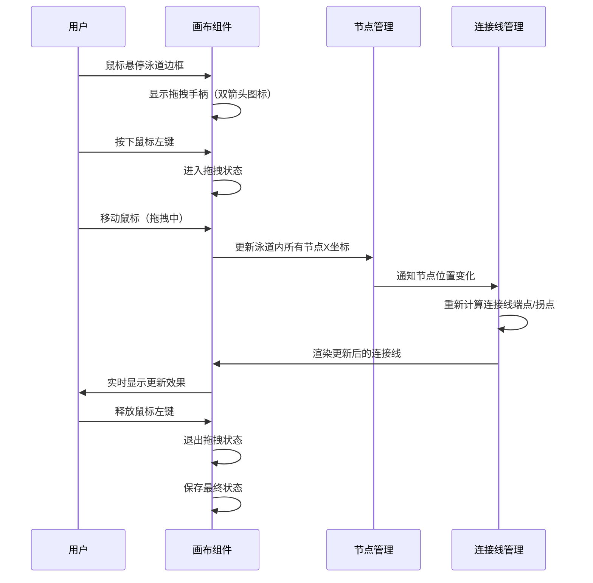
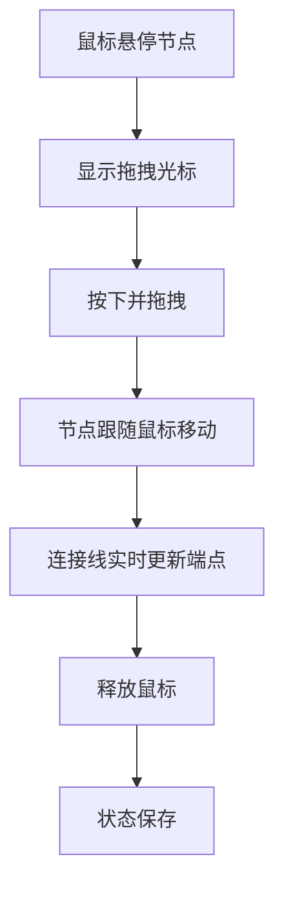

# 附件A：页面与交互说明

> **文档状态**: 草稿  
> **版本**: v1.0.0  
> **关联PRD**: [PRD_Main.md](./PRD_Main.md)

---

## 1. 页面结构

### 1.1 流程图编辑页布局

```
┌─────────────────────────────────────────────────────────────┐
│  工具栏  [保存][撤销][重做][导出]...                         │
├──────────────┬──────────────────────────────────────────────┤
│              │                                              │
│  左侧面板    │          画布区域（流程图编辑区）             │
│  组件库      │                                              │
│              │                                              │
│  - 矩形     │   ┌──────────┐    ┌──────────┐              │
│  - 菱形     │   │  节点1   │───>│  节点2   │              │
│  - 圆形     │   └──────────┘    └──────────┘              │
│              │                                              │
│              │  ← 拖拽区域 →                                │
│              │                                              │
└──────────────┴──────────────────────────────────────────────┘
```

**画布区域说明**：
- 中央区域为流程图画布
- 泳道图包含多个垂直泳道，每个泳道有独立边框
- 泳道边框可拖拽调整列宽

---

## 2. 交互详情

### 2.1 垂直泳道列宽拖拽交互（F01）

**交互流程**：



**视觉细节**：

| 状态 | 视觉表现 | 备注 |
|-----|---------|-----|
| 悬停 | 边框高亮显示，鼠标变为双箭头（↔） | 边框宽度临时增至3px |
| 拖拽中 | 显示半透明拖拽预览线，节点和连接线实时更新 | 拖拽距离限制：最小100px，最大800px |
| 释放 | 预览线消失，状态定格 | 支持ESC取消 |

**交互规则**：
1. 拖拽手柄宽度：10px（边框两侧各5px可触发）
2. 最小列宽：100px
3. 最大列宽：800px
4. 同步更新：泳道内所有节点跟随移动，连接线实时重绘
5. 相邻泳道：调整当前泳道列宽时，相邻泳道不自动压缩，而是整体画布扩展

---

### 2.2 水平泳道行高拖拽交互（F02）

与垂直泳道类似，但方向为垂直拖拽（↕）。

**视觉细节**：
- 拖拽图标为上下双箭头
- 最小行高：80px
- 最大行高：600px

---

### 2.3 单节点拖拽交互（F03）

**交互流程**：



**连接线更新逻辑**：
- **直线连接**：直接更新两端点坐标至节点中心点
- **折线连接**：保持拐点相对位置，仅更新两端点
- **曲线连接**：重新计算贝塞尔曲线控制点

**示例**：

```
拖拽前：
    ┌─────┐
    │  A  │───┐
    └─────┘   │    ┌─────┐
              ├───>│  B  │
    ┌─────┐   │    └─────┘
    │  C  │───┘
    └─────┘

拖拽B向右移动50px后：
    ┌─────┐
    │  A  │───┐
    └─────┘   │         ┌─────┐
              ├───────>│  B  │
    ┌─────┐   │         └─────┘
    │  C  │───┘
    └─────┘
    <── 50px ──>
```

---

### 2.4 多节点拖拽交互（F04）

**交互流程**：
1. 用户框选多个节点
2. 拖拽其中任意节点
3. 所有选中节点同步移动
4. 连接线按以下规则更新：
   - 两端都在选中框内：连接线整体跟随移动
   - 仅一端在选中框内：更新该端点，另一端保持不动

**示例**：

```
选中节点A和C并拖拽：
    ┌─────┐         ┌─────┐
    │  A  │───┐    │  B  │
    └─────┘   │    └─────┘
              ├───>
    ┌─────┐   │
    │  C  │───┘
    └─────┘
        ↓ 拖拽向右
    ┌─────┐         ┌─────┐
    │  A  │───┐    │  B  │
    └─────┘   │    └─────┘
              ├───>
    ┌─────┐   │
    │  C  │───┘
    └─────┘
```

---

### 2.5 撤销/重做交互（F05）

| 操作 | 快捷键 | 效果 |
|-----|-------|-----|
| 撤销 | Ctrl+Z / Cmd+Z | 恢复上一次拖拽前的状态（节点位置+连接线） |
| 重做 | Ctrl+Shift+Z / Cmd+Shift+Z | 重做已撤销的拖拽操作 |

**状态保存内容**：
- 所有节点位置坐标
- 所有连接线端点坐标
- 所有连接线拐点坐标
- 泳道宽度/高度

---

## 3. 连接线类型支持

### 3.1 直线（Straight）

```
    ┌─────┐         ┌─────┐
    │  A  │────────>│  B  │
    └─────┘         └─────┘
```

**更新规则**：两端点直接跟随节点中心点移动

### 3.2 折线（Polyline）

```
    ┌─────┐
    │  A  │──┐
    └─────┘  │    ┌─────┐
             ├───>│  B  │
    ┌─────┐  │    └─────┘
    │  C  │──┘
    └─────┘
```

**更新规则**：
- 泳道拖拽时：拐点按泳道宽度百分比保持相对位置
- 节点拖拽时：仅更新两端点，拐点位置不变

### 3.3 曲线（Curve）

```
    ┌─────┐
    │  A  │ ╭───╮
    └─────┘ │   │  ┌─────┐
            │   ╰─>│  B  │
    ┌─────┐ │      └─────┘
    │  C  │─╯
    └─────┘
```

**更新规则**：
- 重新计算贝塞尔曲线控制点，保持曲线平滑
- 控制点距离节点的距离按比例调整

---

## 4. 性能优化方案

### 4.1 大数量场景降级策略

| 节点数量 | 优化策略 |
|---------|---------|
| <50 | 完整实时渲染 |
| 50-200 | 使用虚拟渲染，仅更新视口内元素 |
| >200 | 拖拽时显示简化边框预览，释放后完整渲染 |

### 4.2 渲染优化
- 使用Canvas渲染而非SVG
- 启用requestAnimationFrame批量更新
- 离屏缓冲预计算

---

## 5. 原型示意图

### 5.1 拖拽前状态

```
┌──────────────────┬──────────────────┬──────────────────┐
│   销售部         │    财务部        │     仓储部       │
│                  │                  │                  │
│  ┌──────────┐   │                  │                  │
│  │  下单    │───>│  ┌──────────┐   │                  │
│  └──────────┘   │  │  审核    │───>│  ┌──────────┐   │
│                  │  └──────────┘   │  │  发货    │   │
│  ┌──────────┐   │                  │  └──────────┘   │
│  │  查询    │   │  ┌──────────┐   │                  │
│  └──────────┘   │  │  记账    │   │                  │
│                  │  └──────────┘   │                  │
└──────────────────┴──────────────────┴──────────────────┘
```

### 5.2 拖拽中状态（加宽销售部）

```
┌──────────────────────┬──────────────────┬──────────────────┐
│   销售部             │    财务部        │     仓储部       │
│                      │                  │                  │
│  ┌──────────┐       │                  │                  │
│  │  下单    │───────>│  ┌──────────┐   │                  │
│  └──────────┘       │  │  审核    │───>│  ┌──────────┐   │
│                      │  └──────────┘   │  │  发货    │   │
│  ┌──────────┐       │                  │  └──────────┘   │
│  │  查询    │       │  ┌──────────┐   │                  │
│  └──────────┘       │  │  记账    │   │                  │
│                      │  └──────────┘   │                  │
└──────────────────────┴──────────────────┴──────────────────┘
       ↑拖拽手柄
```
